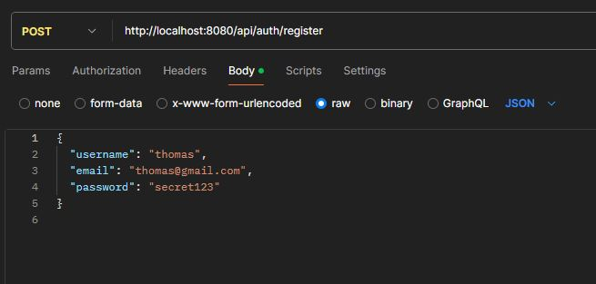
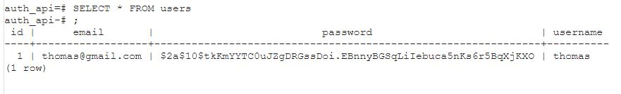
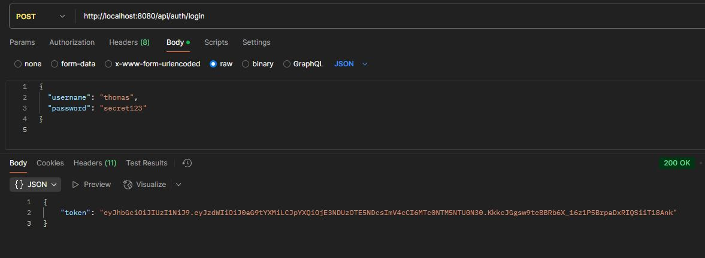

# Spring Boot Backend Auth API

REST API with user registration, login, JWT authentication.

Register tested via Postman:

PostgreSQL user registration confirmation:

Login tested via Postman + JWT generated:
